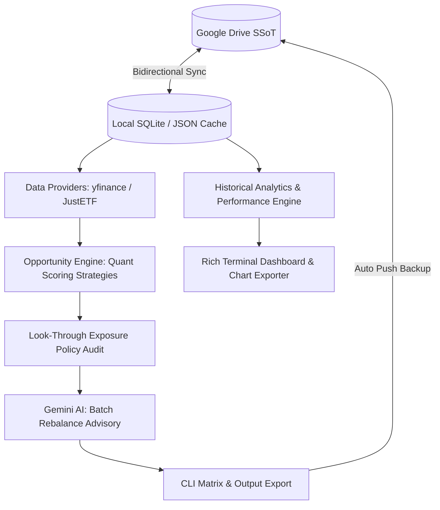

# Finances Portfolio Tracker & Opportunity Engine


<br />


<br />


---

The **Finances Portfolio Tracker & Opportunity Engine** is an enterprise-grade command-line interface (CLI) application engineered to track personal investment portfolios, monitor real-time prices, audit look-through exposures, evaluate fundamental quality tiers, export visual performance analytics, and execute **deterministic multi-factor rebalancing powered by Google Gemini AI**.

Designed with strict separation of concerns, the system utilizes Google Drive as a **Cloud Single Source of Truth (SSoT)** for all dynamic datasets (`finances.db`, active portfolios, wishlist targets, and cached fundamentals). It seamlessly blends real-time market data retrieval, multi-currency conversion, relational SQLite persistence, and quantitative scoring models.

---


## System Architecture & Directory Blueprint

The repository follows a clean, modular architecture segregating domain entities, infrastructure providers, scoring strategies, analytics, and presentation layers.


| Layer                    | Path                                | Description                                                                                                                  |
|:-------------------------|:------------------------------------|:-----------------------------------------------------------------------------------------------------------------------------|
| **CLI & Presentation**   | `src/cli/` & `main.py`              | Typer-powered CLI entrypoints (`dashboard`, `opportunity`, `quality`, `fundamentals`).                                       |
| **Core Domain Models**   | `src/core/models.py`                | Immutable domain dataclasses (`Asset`, `Quotation`, `PortfolioSnapshot`, `StockDetails`, `ETFDetails`).                      |
| **Scoring Strategies**   | `src/core/opportunity_evaluation/`  | Strategy pattern orchestrating asset priority scoring (`dip_score`, `cost_score`, `allocation_score`) with penalty factors.  |
| **Exposure Engine**      | `src/core/exposure.py`              | Consolidates look-through sector, geographic, and company allocations across direct equities and ETFs.                       |
| **Analytics Engine**     | `src/core/portfolio_analytics.py`   | Historical time-series processing, ATH tracking, drawdown analysis, and ROI calculation.                                     |
| **AI Advisory**          | `src/infra/ai/`                     | Google Gemini API client (`gemini-3.6-flash`) executing batch structured JSON portfolio analysis.                            |
| **Relational Storage**   | `src/infra/database/`               | SQLite database connection management, schema initialization DDLs, and SQL extraction queries.                               |
| **Cloud SSoT Engine**    | `src/infra/gdrive/`                 | Google Drive service wrapper handling bidirectional synchronization of database and config files.                            |
| **JustETF Scraper**      | `src/infra/justetf/`                | Web scraper client retrieving ETF compositions, sector weights, country allocations, and TER metrics.                        |
| **Graphics & Utilities** | `src/utils/`                        | Matplotlib chart exporters, ANSI-colored terminal logging, and automated coverage badge generation.                          |

---

## Core Technical Deep Dives

### 1. Deterministic Opportunity Engine & Strategy Scoring (`src/core/opportunity_evaluation/`)
Rather than relying solely on AI outputs, the system uses deterministic multi-factor scoring strategies:
* **Stock Strategy** (`stock_strategy.py`): Evaluates price pullbacks from recent peaks using a trapezoidal sweet-spot curve (penalizing falling knives), forward vs. trailing P/E growth ratios, positioning relative to the 52-week range, and target allocation gaps.
* **ETF Strategy** (`etf_strategy.py`): Evaluates technical discount sweet-spots, cost efficiency via Total Expense Ratio (TER), and current vs. target allocation gaps.
* **Exposure Penalty Multipliers**: Multiplicatively scales down the `total_score` of assets that breach configured sector, country, or single-company concentration thresholds.


### 2. Look-Through Portfolio Exposure Policies (`src/core/exposure.py`)
* **Look-Through Aggregation**: Unpacks underlying ETF holdings (via JustETF data) and merges them with direct equity positions to determine true portfolio-wide concentration.
* **Policy Constraints**: Enforces default thresholds for Country Allocation (Max 60%), Tech Sector Allocation (Max 50%), Other Sectors (Max 15%), and Single Company Exposure (Max 15%).

### 3. Absolute Quality Tier Evaluation (`src/cli/quality.py` & `src/core/analysis.py`)
* **Fundamental Scoring**: Evaluates asset fundamentals on a 0–100 scale, assigning Tier A, Tier B, or Tier C classifications based on profit margins, YoY revenue expansion, balance sheet leverage (Debt-to-Equity), and earnings trajectory.
* **Diagnostic Reporting**: Outputs visual terminal summary cards detailing Bull Case catalysts, Bear Case risks, and explicit Valuation Status (`Undervalued`, `Fair Value`, `Overvalued`).

### 4. Historical Analytics & Performance Dashboard (`src/cli/dashboard.py & src/core/portfolio_analytics.py`)
* **Time-Series Valuation**: Extracts and processes full portfolio snapshots to compute historical valuation curves, All-Time Highs (ATH), and maximum drawdowns.
* **Class Allocation & Drift**: Monitors the evolving weight ratio between Stocks and ETFs over time, measuring deviation against target asset allocations.
* **Asset Growth & ROI Summary**: Computes total monetary return (€) and percentage gain (%) compared against cost basis for every asset.
* **Automated Visual Chart Export**: Renders clean, publication-ready historical performance charts to output/plots/ using Matplotlib and Seaborn.

### 5. Gemini AI Batch Advisory (`src/infra/ai/`)
* **Enterprise Client (`GeminiClient`)**: Powered by `gemini-3.6-flash` via the Google GenAI SDK, featuring exponential backoff retry mechanisms for transient errors and quotas.
* **Batch Portfolio Analysis**: Processes the entire target asset wishlist in a single API call, returning strict structured JSON validated through Pydantic (`BatchRebalanceRecommendations`).
* **Graceful Fallback**: Automatically falls back to the quantitative opportunity matrix if AI quotas are exhausted or credentials are unconfigured.

### 6. Cloud SSoT Architecture (`src/infra/gdrive/`)
* **Stateless Local Environment**: The local `data/` directory is ephemeral and strictly ignored by Git (`.gitignore`).
* **Automated Bidirectional Sync**: At application startup, all required operational files (`finances.db`, `portfolio.json`, `portfolio_targets.json`, `etf_cache.json`, `system_instruction.json`) are automatically pulled from Google Drive.
* **Automated Persistence**: Any command generating or modifying data immediately pushes the updated state back to Google Drive upon process completion.

---

## Strategy Configuration & Policy Limits

All strategy weights, scoring bounds, and policy thresholds are centrally defined in `src/config.py` and overridden via `.env`:

```ini
# Gemini AI Configuration
GEMINI_API_KEY=your_api_key_here
GEMINI_MODEL=gemini-3.6-flash

# Google Drive Folders (Cloud SSoT)
GDRIVE_CLIENT_SECRET_FILE=secrets/credentials.json
GDRIVE_TOKEN_FILE=secrets/token.json
GDRIVE_CONFIG_FOLDER_ID=your_config_folder_id
GDRIVE_SNAPSHOT_FOLDER_ID=your_snapshot_folder_id
GDRIVE_REPORTS_FOLDER_ID=your_reports_folder_id
GDRIVE_DATABASE_FOLDER_ID=your_database_folder_id

# Scoring Strategy Weights (Must sum to 1.0)
STOCK_WEIGHT_DIP=0.30
STOCK_WEIGHT_FORWARD_PE=0.30
STOCK_WEIGHT_52W_RANGE=0.15
STOCK_WEIGHT_ALLOCATION=0.25

ETF_WEIGHT_DIP=0.40
ETF_WEIGHT_TER=0.20
ETF_WEIGHT_ALLOCATION=0.40
```

---

## Relational Database Schema Overview

The central finances.db SQLite database is managed via transactional connection contexts and automatic DDL migrations (`src/infra/database/schema.py`):

* `assets`: Stores registered holdings (ISIN, Yahoo ticker, quantity, average buy price, asset type).
* `snapshots` & `asset_snapshots`: Records timestamped portfolio valuation history and multi-currency exchange rates.
* `stock_fundamental_history`: Tracks historical equity fundamentals (P/E ratios, dividend yield, 52w range, quality tier, quality score).
* `etf_fundamental_history`: Stores historical ETF metadata (TER, holdings JSON, sector/country breakdown JSON, quality tier, quality score).
* `opportunities` & `opportunity_asset_metrics`: Logs historical rebalancing runs, factor scores, and AI recommendations.

___

## CLI Reference & Usage

The application is controlled via a rich Typer CLI interface defined in `main.py` and GNU Make shortcuts. All operational workflows are accessible directly through the main entrypoint.

---

### Portfolio Monitoring & Opportunity Execution

**Portfolio Performance & Analytics**:

```bash
# Render executive historical performance dashboard in terminal
make dashboard

# Render dashboard for a specific asset ticker
make dashboard TICKER="AAPL"

# Render dashboard and export visual performance plots to output/plots/
make dashboard FLAGS="--export-plots"
```

**Rebalancing Opportunities & Quality Analysis**:

```bash
# Full Rebalancing Opportunity Pipeline (Quantitative Scoring + Gemini AI Batch Analysis)
make analyze-opportunity

# Run opportunity engine in quantitative-only mode (bypassing AI)
make analyze-opportunity FLAGS="--skip-ai"

# Execute independent fundamental health & quality tier evaluation (all assets)
make analyze-quality

# Execute quality evaluation for a specific asset ticker
make analyze-quality TICKER="AAPL"

# Save timestamped portfolio valuation snapshot to SQLite and backup to Google Drive
make save-snapshot

# Inspect consolidated sector and country exposure across active holdings
make exposure
```

**Asset Inspection & System Data Sync**:

```bash
# Inspect composition, TER, top holdings, and breakdowns for an ETF
make etf-details TICKER="IE00BK5BQT36"

# Inspect fundamental metrics (P/E, Market Cap, Debt/Equity) for a stock
make stock-details TICKER="AAPL"

# Pull configuration and database files from Google Drive
make pull-config

# Push local configuration and database files to Google Drive
make push-config

# Migrate legacy JSON portfolio and history files into SQLite database
make migrate

# Synchronize live fundamental snapshots into SQLite history
make sync-fundamentals
```

---

## Database Schema & Legacy Data Migration

The application relies on SQLite for structured relational persistence, enforcing foreign key integrity, transactional isolation, and historical tracking.

### Automatic Schema Initialization

Database tables and indexes are managed automatically via `src/infra/database/schema.py`. Upon establishing a database connection context (`get_db_context`), the system executes `initialize_database(conn)` to ensure all required relational structures exist:

* **`assets`**: Stores active portfolio equities and ETFs, ISINs, tickers, quantities, and average buy prices.
* **`snapshots` & `asset_snapshots`**: Persists timestamped portfolio valuations, total returns, and asset weight distributions.
* **`stock_fundamental_history`**: Records historical equity metrics, fundamental scores, quality tiers, and valuation diagnostics.
* **`etf_fundamental_history`**: Stores TER, top holdings, sector allocations, geographic distributions, and quality tiers in structured JSON columns[cite: 30].
* **`opportunities` & `opportunity_asset_metrics`**: Persists multi-factor rebalancing runs and AI-driven recommendations[cite: 30].

### Migrating Legacy JSON Storage to SQLite

When upgrading from legacy file-based setups (`portfolio.json` and `portfolio_targets.json`), execute the standalone migration utility to populate `finances.db`[cite: 30]:

```bash
# Run migration script to transform legacy JSON files into relational SQLite records
python -m src.migrate_json_to_sqlite
```

The migration pipeline executes the following steps:

1. Validates and initializes the target SQLite database schema.

2. Parses active holdings and allocation target percentages from local or pulled JSON files.

3. Inserts asset records into the `assets` table while preventing duplicate ISIN entries.

4. Triggers an automated Cloud SSoT backup, synchronizing the updated `finances.db` directly to Google Drive.

---

## Quality Gates & Testing Suite

The project enforces strict code quality standards, verified through automated GitHub Actions CI pipelines (`ci.yml`).

Development tasks and quality checks are orchestrated via GNU Make shortcuts:

| Target                | Description                                                                                                   |
|:----------------------|:--------------------------------------------------------------------------------------------------------------|
| `make quality`        | Runs complete quality pipeline (Black, Ruff, Mypy, Bandit, Pip-Audit, Pytest).                                |
| `make test`           | Executes unit tests with branch coverage report.                                                              |
| `make format`         | Automatically formats code with Black and fixes lint issues with Ruff.                                        |
| `make lint`           | Runs code formatting verification, Ruff linting, and Mypy type checking.                                      |
| `make security-check` | Executes Bandit SAST security analysis and Pip-Audit dependency check.                                        |
| `make clean`          | Cleans temporary cache files, coverage reports, and build artifacts.                                          |

The quality pipeline executes:
- **Black**: Code formatting verification (`black --check`).
- **Ruff**: Fast Python linting and import sorting (`ruff check`).
- **Mypy**: Strict static type checking across all modules (`mypy`).
- **Bandit**: Security vulnerability scanning (`bandit`).
- **Pip-Audit**: Known dependency vulnerability auditing (`pip-audit`).
- **Pytest**: Unit test execution with rigorous branch coverage reporting (`pytest --cov=src`).

---

## CI/CD Pipelines

* **CI Quality & Security Pipeline** (`.github/workflows/ci.yml`): Triggered on push or PR to main. Executes Black, Ruff, Mypy, Bandit, Pip-Audit, and Pytest with branch coverage, automatically updating the `coverage.svg` badge.
* **Weekly Execution Pipeline** (`.github/workflows/sync-fundamentals_3.yml`): Scheduled every Sunday at 00:00 UTC. Automatically fetches live fundamental metrics, records valuation snapshots, updates quality tiers, ranks opportunities via Gemini AI, and commits updated database state back to the repository.

---

## License

Distributed under the MIT License.

Developed and maintained by **João Pedro** ([@JoPedro15](https://github.com/JoPedro15)).

> *Fueled by Espresso, CrossFit WODs, and powered by Gemini AI collaboration.* ☕🏋️‍♂️🤖