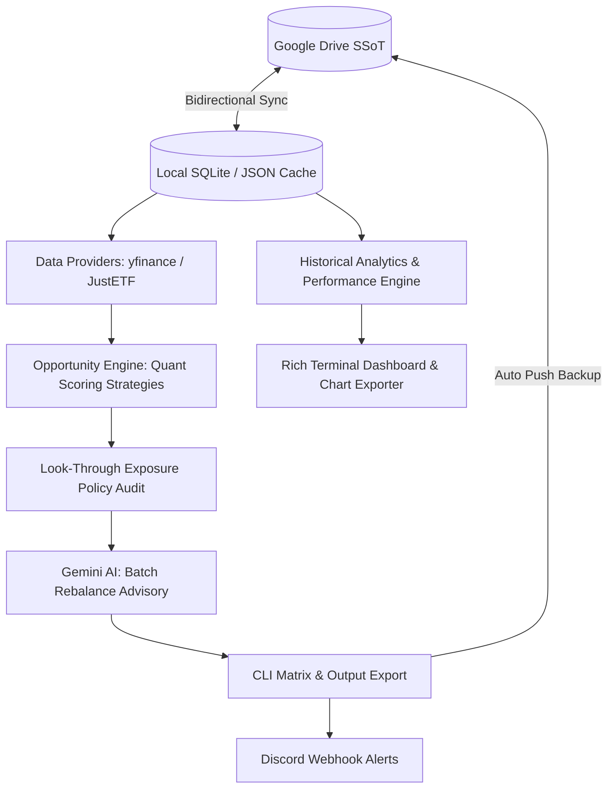

# Finances Portfolio Tracker & Opportunity Engine


<br />


<br />


> **⚠️ Financial Disclaimer:** This software is for educational and personal portfolio tracking only. It does not constitute financial advice. Algorithmic scores and Gemini AI recommendations are automated insights, not trading signals. Read the full [DISCLAIMER.md](DISCLAIMER.md) before executing any commands. Use at your own risk.

---

The **Finances Portfolio Tracker & Opportunity Engine** is an enterprise-grade command-line interface (CLI) application engineered to track personal investment portfolios, monitor real-time prices, audit look-through exposures, evaluate fundamental quality tiers, export visual performance analytics, dispatch Discord rebalance alerts, and execute **deterministic multi-factor rebalancing powered by Google Gemini AI**.

Designed with strict separation of concerns, the system utilizes Google Drive as a **Cloud Single Source of Truth (SSoT)** for dynamic datasets (`finances.db`, active portfolios, wishlist targets, and cached fundamentals). It seamlessly blends real-time market data retrieval, multi-currency conversion, relational SQLite persistence, and quantitative scoring models.

---

## System Architecture & Directory Blueprint

The repository follows a clean, modular architecture segregating domain entities, infrastructure providers, scoring strategies, analytics, notifications, and presentation layers.



| Layer                    | Path                                | Description                                                                                                                  |
|:-------------------------|:------------------------------------|:-----------------------------------------------------------------------------------------------------------------------------|
| **CLI & Presentation**   | `src/cli/` & `main.py`              | Typer-powered CLI entrypoints (`dashboard`, `opportunity_evaluation`, `analyze-quality`, `fundamentals`, `project-growth`).  |
| **Core Domain Models**   | `src/core/models.py`                | Immutable domain dataclasses (`Asset`, `Quotation`, `PortfolioSnapshot`, `GrowthMilestone`, `GrowthProjectionResult`, etc.). |
| **Projections Engine**   | `src/core/projections.py`           | Financial mathematics for long-term compound growth forecasting with inflation adjustment logic.                             |
| **Scoring Strategies**   | `src/core/opportunity_evaluation/`  | Strategy pattern orchestrating asset priority scoring (`dip_score`, `cost_score`, `allocation_score`) with penalty factors.  |
| **Exposure Engine**      | `src/core/exposure.py`              | Consolidates look-through sector, geographic, and company allocations across direct equities and ETFs.                       |
| **Analytics Engine**     | `src/core/portfolio_analytics.py`   | Historical time-series processing, ATH tracking, drawdown analysis, and ROI calculation.                                     |
| **AI Advisory**          | `src/infra/ai/`                     | Google Gemini API client (`gemini-3.6-flash`) executing batch structured JSON portfolio analysis.                            |
| **Discord Notifications**| `src/infra/notifications/`          | Discord webhook integration formatting rich embeds, decision matrices, and recommendation action cards.                      |
| **Relational Storage**   | `src/infra/database/`               | SQLite database connection management, transactional contexts, DDL schema, and historical query extractors.                  |
| **Cloud SSoT Engine**    | `src/infra/gdrive/`                 | Google Drive service wrapper handling bidirectional synchronization of database, snapshots, and config files.                |
| **JustETF Scraper**      | `src/infra/justetf/`                | Web scraper client retrieving ETF compositions, sector weights, country allocations, and TER metrics.                        |
| **Graphics & Utilities** | `src/utils/`                        | Matplotlib chart exporters and ANSI-colored terminal logging.                                                                |

---

## Core Technical Deep Dives

### 1. Deterministic Opportunity Engine & Strategy Scoring (`src/core/opportunity_evaluation/`)
Rather than relying solely on AI outputs, the system uses deterministic multi-factor scoring strategies:
* **Stock Strategy** (`stock_strategy.py`): Evaluates price pullbacks from recent peaks using a trapezoidal sweet-spot curve (penalizing falling knives), forward vs. trailing P/E growth ratios, positioning relative to the 52-week range, and **normalized relative target allocation gaps** (percentage of the target missing).
* **ETF Strategy** (`etf_strategy.py`): Evaluates technical discount sweet-spots, cost efficiency via Total Expense Ratio (TER), and **normalized relative target allocation gaps**.
* **Exposure Penalty Multipliers**: Multiplicatively scales down the `total_score` of assets that breach configured sector, country, or single-company concentration thresholds.

### 2. Look-Through Portfolio Exposure Policies (`src/core/exposure.py`)
* **Look-Through Aggregation**: Unpacks underlying ETF holdings (via JustETF data) and merges them with direct equity positions to determine true portfolio-wide concentration.
* **Policy Constraints**: Enforces default thresholds for Country Allocation (Max 60%), Tech Sector Allocation (Max 50%), Other Sectors (Max 15%), and Single Company Exposure (Max 15%).

### 3. Absolute Quality Tier Evaluation (`src/cli/quality.py` & `src/core/analysis.py`)
* **Fundamental Scoring**: Evaluates asset fundamentals on a 0–100 scale, assigning Tier A, Tier B, or Tier C classifications based on profit margins, YoY revenue expansion, balance sheet leverage (Debt-to-Equity), and earnings trajectory.
* **Diagnostic Reporting**: Outputs visual terminal summary cards detailing Bull Case catalysts, Bear Case risks, and explicit Valuation Status (`Undervalued`, `Fair Value`, `Overvalued`).

### 4. Historical Analytics & Performance Dashboard (`src/cli/dashboard.py` & `src/core/portfolio_analytics.py`)
* **Time-Series Valuation**: Extracts and processes full portfolio snapshots to compute historical valuation curves, All-Time Highs (ATH), and maximum drawdowns.
* **Class Allocation & Drift**: Monitors the evolving weight ratio between Stocks and ETFs over time, measuring deviation against target asset allocations.
* **Asset Growth & ROI Summary**: Computes total monetary return (€) and percentage gain (%) compared against cost basis for every asset.
* **Automated Visual Chart Export**: Renders clean, publication-ready historical performance charts to `output/plots/` using Matplotlib and Seaborn.

### 5. Long-Term Growth Projections (`src/core/projections.py`)
* **Compound Growth Engine**: Forecasts portfolio evolution over 10, 20, and 30 years using the compound interest annuity formula ($FV = PV(1+r)^t + PMT \frac{(1+r)^t - 1}{r}$).
* **Inflation Adjustment**: Calculates "Real Value" by discounting future nominal totals by a 2% annual inflation target to reflect future purchasing power in today's Euros.
* **Historical Performance Baseline**: Automatically computes the Compound Annual Growth Rate (CAGR) from SQLite history. For periods under 1 year, it intelligently uses Absolute Return to maintain realistic baseline projections.

### 6. Gemini AI Batch Advisory (`src/infra/ai/`)
* **Enterprise Client (`GeminiClient`)**: Powered by `gemini-3.6-flash` via the Google GenAI SDK, featuring exponential backoff retry mechanisms for transient errors and quotas.
* **Batch Portfolio Analysis**: Processes the entire target asset wishlist in a single API call, returning strict structured JSON validated through Pydantic (`BatchRebalanceRecommendations`).
* **Graceful Fallback**: Automatically falls back to the quantitative opportunity matrix if AI quotas are exhausted or credentials are unconfigured.

### 7. Discord Alerts & Webhook Notifications (`src/infra/notifications/discord.py`)
* **Rich Embeds & Action Cards**: Formats portfolio valuation totals, active strategy weights, decision matrices, and color-coded action recommendations (`BUY` / `SELL` / `HOLD`).
* **Factor Scores & Reasoning**: Dispatches granular factor breakdowns (Dip, Valuation, Gap, Quant Total) and AI reasoning directly to configured Discord channels.

### 8. Cloud SSoT Architecture (`src/infra/gdrive/`)
* **Stateless Local Environment**: The local `data/` directory is ephemeral and strictly ignored by Git (`.gitignore`).
* **Automated Bidirectional Sync**: At application startup or command run, required operational files (`finances.db`, `portfolio.json`, `portfolio_targets.json`, `etf_cache.json`, `system_instruction.json`) are synchronized with Google Drive.
* **Automated Persistence**: Commands generating or modifying data push updated state back to Google Drive upon process completion.

---

## Strategy Configuration & Policy Limits

All strategy weights, scoring bounds, and policy thresholds are centrally defined in `src/config.py` and overridden via `.env`:

```ini
# Gemini AI Configuration
GEMINI_API_KEY=your_api_key_here
GEMINI_MODEL=gemini-3.6-flash

# Discord Notifications Webhook
DISCORD_WEBHOOK_URL=https://discord.com/api/webhooks/your_webhook_id/your_token
DISCORD_TEST_MODE=False

# Google Drive Folders (Cloud SSoT)
GDRIVE_CLIENT_SECRET_FILE=secrets/credentials.json
GDRIVE_TOKEN_FILE=secrets/token.json
GDRIVE_CONFIG_FOLDER_ID=your_config_folder_id
GDRIVE_SNAPSHOT_FOLDER_ID=your_snapshot_folder_id
GDRIVE_REPORTS_FOLDER_ID=your_reports_folder_id
GDRIVE_DATABASE_FOLDER_ID=your_database_folder_id

# Scoring Strategy Weights (Must sum to 1.0)
STOCK_WEIGHT_DIP=0.35
STOCK_WEIGHT_FORWARD_PE=0.35
STOCK_WEIGHT_52W_RANGE=0.15
STOCK_WEIGHT_ALLOCATION=0.15

ETF_WEIGHT_DIP=0.60
ETF_WEIGHT_TER=0.20
ETF_WEIGHT_ALLOCATION=0.20

# Exposure Policy Limits
MAX_COUNTRY_ALLOCATION_PCT=60.0
MAX_TECH_ALLOCATION_PCT=50.0
MAX_OTHER_SECTOR_ALLOCATION_PCT=15.0
MAX_COMPANY_ALLOCATION_PCT=15.0
```

---

## Relational Database Schema Overview

The central `finances.db` SQLite database is managed via transactional connection contexts and automatic DDL migrations (`src/infra/database/schema.py`):

### Schema Overview

* `assets`: Stores registered holdings (ISIN, Yahoo ticker, quantity, average buy price, asset type).
* `snapshots` & `asset_snapshots`: Records timestamped portfolio valuation history and multi-currency exchange rates.
* `stock_fundamental_history`: Tracks historical equity fundamentals (P/E ratios, dividend yield, 52w range, quality tier, quality score).
* `etf_fundamental_history`: Stores historical ETF metadata (TER, holdings JSON, sector/country breakdown JSON, quality tier, quality score).
* `opportunities` & `opportunity_asset_metrics`: Logs historical rebalancing runs, factor scores, and AI recommendations.

### Migrating Legacy JSON Storage to SQLite

When upgrading from legacy file-based setups (`portfolio.json` and `portfolio_targets.json`), execute the migration utility to populate `finances.db`:

```bash
# Run migration script to transform legacy JSON files into relational SQLite records
make migrate
# or: python -m src.migrate_json_to_sqlite
```

---

## CLI Reference & Usage

The application is controlled via a rich Typer CLI interface defined in `main.py` and GNU Make shortcuts. All operational workflows are accessible directly through the main entrypoint.

---

### End-to-End Workflow & Portfolio Monitoring

**Full Routine Update (Recommended)**:

```bash
# Executes complete cycle: pull config -> sync fundamentals -> save snapshot -> check exposure -> analyze quality -> analyze opportunity -> dashboard + charts -> push config
# All results and charts are automatically dispatched to Discord
make update-finances
```

**Portfolio Performance & Analytics**:

```bash
# Render executive historical performance dashboard in terminal
make dashboard

# Render dashboard for a specific asset ticker
make dashboard TICKER="AAPL"

# Render dashboard and export visual performance plots to output/plots/
make dashboard FLAGS="--export-plots"
```

**Rebalancing Opportunities & Quality Analysis**:

```bash
# Full Rebalancing Opportunity Pipeline (Quantitative Scoring + Gemini AI Batch Analysis)
make analyze-opportunity

# Project long-term portfolio growth (10y, 20y, 30y) with inflation adjustment
make project-growth

# Compare projection scenarios (Conservative, Moderate, Aggressive) with monthly contributions
make project-growth FLAGS="--compare-scenarios --monthly-contribution 500"

# Run opportunity engine in quantitative-only mode (bypassing AI)
make analyze-opportunity FLAGS="--skip-ai"

# Run opportunity with verbose factor breakdown
make analyze-opportunity FLAGS="--verbose"

# Execute independent fundamental health & quality tier evaluation (all assets)
make analyze-quality

# Execute quality evaluation for a specific asset ticker
make analyze-quality TICKER="AAPL"

# Save timestamped portfolio valuation snapshot to SQLite and backup to Google Drive
make save-snapshot

# Inspect consolidated sector, country, and single company look-through exposure
make exposure
```

**Asset Inspection & System Data Sync**:

```bash
# Inspect composition, TER, top holdings, and breakdowns for an ETF
make etf-details
# or for a specific ISIN:
python main.py etf-details IE00BK5BQT36

# Inspect fundamental metrics (P/E, Market Cap, Debt/Equity) for stocks
make stock-details
# or for a specific ticker:
python main.py stock-details AAPL

# Pull configuration and database files from Google Drive
make pull-config

# Push local configuration and database files to Google Drive
make push-config

# Sync portfolio (migrate JSON to SQLite and push to Google Drive)
make sync-portfolio

# Synchronize live fundamental snapshots into SQLite history
make sync-fundamentals
```

---

## Quality Gates & Testing Suite

The project enforces strict code quality standards, verified through automated GitHub Actions CI pipelines (`ci.yml`).

Development tasks and quality checks are orchestrated via GNU Make shortcuts:

| Target                | Description                                                                                                   |
|:----------------------|:--------------------------------------------------------------------------------------------------------------|
| `make quality`        | Runs complete quality pipeline (Black, Ruff, Mypy, Bandit, Pip-Audit, Pytest).                                |
| `make test`           | Executes unit tests with branch coverage report.                                                              |
| `make format`         | Automatically formats code with Black and fixes lint issues with Ruff.                                        |
| `make lint`           | Runs code formatting verification, Ruff linting, and Mypy type checking.                                      |
| `make security-check` | Executes Bandit SAST security analysis and Pip-Audit dependency check.                                        |
| `make clean`          | Cleans temporary cache files, coverage reports, and build artifacts.                                          |

The quality pipeline executes:
- **Black**: Code formatting verification (`black --check`).
- **Ruff**: Fast Python linting and import sorting (`ruff check`).
- **Mypy**: Strict static type checking across all modules (`mypy`).
- **Bandit**: Security vulnerability scanning (`bandit`).
- **Pip-Audit**: Known dependency vulnerability auditing (`pip-audit`).
- **Pytest**: Unit test execution with rigorous branch coverage reporting (`pytest --cov=src`).

---

## CI/CD Pipelines

* **CI Quality & Security Pipeline** (`.github/workflows/ci.yml`): Triggered on push or PR to `main`. Executes Black, Ruff, Mypy, Bandit, Pip-Audit, and Pytest with branch coverage, automatically updating the `coverage.svg` badge.
* **Weekly Portfolio Pipeline** (`.github/workflows/sync-fundamentals.yml`): Scheduled every Sunday at 00:00 UTC. Automatically synchronizes live fundamentals, captures valuation snapshots, runs quality analysis, executes opportunity rebalancing with Gemini AI, and commits updated database state.

---

## License

Distributed under the MIT License.

Developed and maintained by **João Pedro** ([@JoPedro15](https://github.com/JoPedro15)).

> *Fueled by Espresso, CrossFit WODs, and powered by Gemini AI collaboration.* ☕🏋️‍♂️🤖
