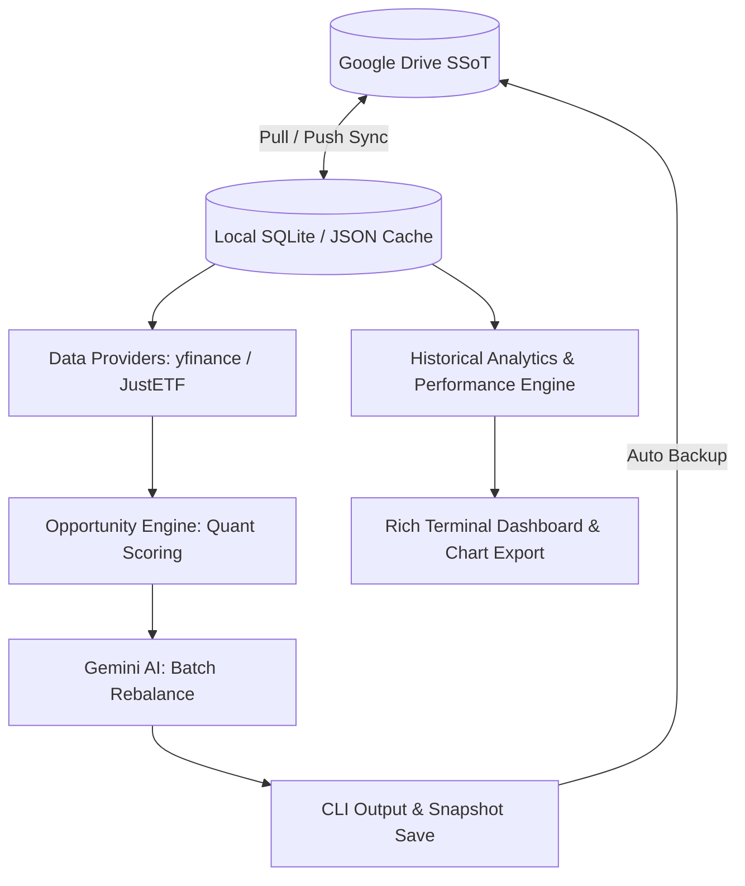

# Finances Portfolio Tracker & Opportunity Engine


<br />


<br />


---

The **Finances Portfolio Tracker & Opportunity Engine** is an enterprise-grade command-line interface (CLI) application engineered to track personal investment portfolios, monitor market prices, analyze historical performance, export visual analytics, and execute **deterministic multi-factor rebalancing powered by Google Gemini AI**.

Designed with a strict separation of concerns, this system leverages Google Drive as a **Cloud Single Source of Truth (SSoT)** for all dynamic data (`finances.db`, portfolios, targets, and caches), integrating real-time market data retrieval, multi-currency conversion, relational SQLite persistence, and quantitative scoring strategies.

---

## Architectural Blueprint & Directory Structure

The repository follows a clean, modular architecture, segregating domain logic, infrastructure providers, opportunity engines, performance analytics, and presentation layers.



| Layer                  | Path                                 | Description                                                                                                                                      |
|:-----------------------|:-------------------------------------|:-------------------------------------------------------------------------------------------------------------------------------------------------|
| **Core Domain**        | `src/core/`                          | Business logic, quotation retrieval, multi-currency exchange, snapshot management, performance analysis, and repository protocols.               |
| **Analytics Engine**   | `src/core/portfolio_analytics.py`    | Historical time-series processing, ATH/drawdown tracking, asset class share breakdown, and ROI calculations.                                     |
| **Opportunity Engine** | `src/core/opportunity_evaluation/`   | Strategy pattern orchestrating asset priority scoring (`dip_score`, `cost_score`, `allocation_score`) with active exposure constraint penalties. |
| **Quality Evaluation** | `src/cli/quality.py`                 | Independent fundamental health analysis, absolute quality tiers (Tier A/B/C), diagnostic terminal cards, and Markdown report export.             |
| **AI Infrastructure**  | `src/infra/ai/`                      | Google Gemini API client (`gemini-3.6-flash`) executing robust batch structured JSON portfolio rebalancing analysis with Pydantic validation.    |
| **Database & Schema**  | `src/infra/database/`                | SQLite connection management, foreign key enforcement, transactional contexts, and SQL extraction queries (`finance_sql_extraction.py`).         |
| **Cloud SSoT Engine**  | `src/infra/gdrive/`                  | Google Drive service wrapper handling bidirectional synchronization of `finances.db` and configuration JSON files.                               |
| **JustETF Scraper**    | `src/infra/justetf/`                 | Scraper client extracting ETF composition, sector weights, geographic allocation, and TER directly from JustETF profile pages.                   |
| **CLI & Automation**   | `src/cli/` & `root`                  | Typer-powered CLI interface (`main.py`, `cli/`) and GNU Make automation workflows.                                                               |

---

## Core Modules & Technical Highlights

### 1. Historical Analytics & Performance Dashboard (`src/cli/dashboard.py & src/core/portfolio_analytics.py`)
* **Time-Series Valuation**: Extracts and processes full portfolio snapshots to compute historical valuation curves, All-Time Highs (ATH), and maximum drawdowns.
* **Class Allocation & Drift**: Monitors the evolving weight ratio between Stocks and ETFs over time, measuring deviation against target asset allocations.
* **Asset Growth & ROI Summary**: Computes total monetary return (€) and percentage gain (%) compared against cost basis for every asset.
* **Automated Visual Chart Export**: Renders clean, publication-ready historical performance charts to output/plots/ using Matplotlib and Seaborn.  


### 2. Deterministic Opportunity Engine & Exposure Policies (`src/core/opportunity_evaluation/` & `src/core/exposure.py`)
Rather than relying purely on opaque LLM predictions, the engine uses explicit quantitative models implementing the Strategy Pattern:
* **Stock Scoring Strategy (`stock_strategy.py`)**: Evaluates price pullbacks from 52-week highs (with *falling knife* protection), forward vs. trailing P/E growth ratios, and 52-week range positioning.
* **ETF Scoring Strategy (`etf_strategy.py`)**: Combines technical discount sweet-spots, cost efficiency via Total Expense Ratio (TER), and target allocation gaps.
* **Exposure Constraint Enforcement**: Actively penalizes the composite priority score (`total_score`) when candidate assets belong to geographic regions, sectors, or individual companies that exceed defined portfolio concentration limits.

### 3. Independent Fundamental Health & Quality Engine (`src/cli/quality.py` & `src/core/analysis.py`)
* **Absolute Quality Tiers**: Classifies portfolio assets into **Tier A**, **Tier B**, or **Tier C** based on deterministic fundamental criteria (profit margins, revenue growth, debt-to-equity ratios, and dividend stability).
* **Diagnostic Terminal Cards**: Renders rich visual cards using `rich` featuring **Bull Case** catalysts, **Bear Case** risks, and explicit **Valuation Status** (`Undervalued`, `Fair Value`, `Overvalued`).
* **Automated Reporting & Persistence**: Exports comprehensive evaluation summaries to Markdown (`output/quality_report.md`) and records historical fundamental snapshots in SQLite (`stock_fundamental_history`, `etf_fundamental_history`).

### 4. Gemini AI Batch Advisory (`src/infra/ai/`)
* **Enterprise Client (`GeminiClient`)**: Powered by `gemini-3.6-flash` via the Google GenAI SDK, featuring exponential backoff retry mechanisms for transient errors and quotas.
* **Batch Portfolio Analysis**: Processes the entire target asset wishlist in a single API call, returning strict structured JSON validated through Pydantic (`BatchRebalanceRecommendations`).
* **Graceful Fallback**: Automatically falls back to the quantitative opportunity matrix if AI quotas are exhausted or credentials are unconfigured.

### 5. Cloud SSoT Architecture (`src/infra/gdrive/`)
* **Stateless Local Environment**: The local `data/` directory is ephemeral and strictly ignored by Git (`.gitignore`).
* **Automated Bidirectional Sync**: At application startup, all required operational files (`finances.db`, `portfolio.json`, `portfolio_targets.json`, `etf_cache.json`, `system_instruction.json`) are automatically pulled from Google Drive.
* **Automated Persistence**: Any command generating or modifying data immediately pushes the updated state back to Google Drive upon process completion.

---

## Quickstart & Setup

1. **Clone repository and initialize environment**:

```bash
git clone https://github.com/JoPedro15/finances.git
cd finances
python3.13 -m venv .venv
source .venv/bin/activate
pip install -r requirements.txt
```

2. **Configure GCP credentials and environment variables**:

```bash
mkdir -p secrets
# Place your GCP OAuth credentials.json in secrets/credentials.json
cp .env.example .env
```

---

## Environment Variables & Configuration

Key configuration parameters in `.env`:

```ini
# Gemini AI Configuration
GEMINI_API_KEY=your_api_key_here
GEMINI_MODEL=gemini-3.6-flash

# Google Drive Folders (Cloud SSoT)
GDRIVE_CLIENT_SECRET_FILE=secrets/credentials.json
GDRIVE_TOKEN_FILE=secrets/token.json
GDRIVE_CONFIG_FOLDER_ID=your_config_folder_id
GDRIVE_SNAPSHOT_FOLDER_ID=your_snapshot_folder_id
GDRIVE_REPORTS_FOLDER_ID=your_reports_folder_id
GDRIVE_DATABASE_FOLDER_ID=your_database_folder_id

# Scoring Strategy Weights (Must sum to 1.0)
STOCK_WEIGHT_DIP=0.30
STOCK_WEIGHT_FORWARD_PE=0.30
STOCK_WEIGHT_52W_RANGE=0.15
STOCK_WEIGHT_ALLOCATION=0.25

ETF_WEIGHT_DIP=0.40
ETF_WEIGHT_TER=0.20
ETF_WEIGHT_ALLOCATION=0.40
```

---

## CLI Reference & Usage

The application is controlled via a rich Typer CLI interface defined in `main.py` and GNU Make shortcuts. All operational workflows are accessible directly through the main entrypoint.

### Portfolio Monitoring & Opportunity Execution

**Portfolio Performance & Analytics**:

```bash
# Render executive historical performance dashboard in terminal
make dashboard

# Render dashboard for a specific asset ticker
make dashboard TICKER="AAPL"

# Render dashboard and export visual performance plots to output/plots/
make dashboard FLAGS="--export-plots"
```

**Rebalancing Opportunities & Quality Analysis**:

```bash
# Full Rebalancing Opportunity Pipeline (Quantitative Scoring + Gemini AI Batch Analysis)
make analyze-opportunity

# Run opportunity engine in quantitative-only mode (bypassing AI)
make analyze-opportunity FLAGS="--skip-ai"

# Execute independent fundamental health & quality tier evaluation (all assets)
make analyze-quality

# Execute quality evaluation for a specific asset ticker
make analyze-quality TICKER="AAPL"

# Save timestamped portfolio valuation snapshot to SQLite and backup to Google Drive
make save-snapshot

# Inspect consolidated sector and country exposure across active holdings
make exposure
```

**Asset Inspection & System Data Sync**:

```bash
# Inspect composition, TER, top holdings, and breakdowns for an ETF
make etf-details TICKER="IE00BK5BQT36"

# Inspect fundamental metrics (P/E, Market Cap, Debt/Equity) for a stock
make stock-details TICKER="AAPL"

# Pull configuration and database files from Google Drive
make pull-config

# Push local configuration and database files to Google Drive
make push-config

# Migrate legacy JSON portfolio and history files into SQLite database
make migrate

# Synchronize live fundamental snapshots into SQLite history
make sync-fundamentals
```

---

## Database Schema & Legacy Data Migration

The application relies on SQLite for structured relational persistence, enforcing foreign key integrity, transactional isolation, and historical tracking.

### Automatic Schema Initialization

Database tables and indexes are managed automatically via `src/infra/database/schema.py`. Upon establishing a database connection context (`get_db_context`), the system executes `initialize_database(conn)` to ensure all required relational structures exist:

* **`assets`**: Stores active portfolio equities and ETFs, ISINs, tickers, quantities, and average buy prices.
* **`snapshots` & `asset_snapshots`**: Persists timestamped portfolio valuations, total returns, and asset weight distributions.
* **`stock_fundamental_history`**: Records historical equity metrics, fundamental scores, quality tiers, and valuation diagnostics.
* **`etf_fundamental_history`**: Stores TER, top holdings, sector allocations, geographic distributions, and quality tiers in structured JSON columns[cite: 30].
* **`opportunities` & `opportunity_asset_metrics`**: Persists multi-factor rebalancing runs and AI-driven recommendations[cite: 30].

### Migrating Legacy JSON Storage to SQLite

When upgrading from legacy file-based setups (`portfolio.json` and `portfolio_targets.json`), execute the standalone migration utility to populate `finances.db`[cite: 30]:

```bash
# Run migration script to transform legacy JSON files into relational SQLite records
python -m src.migrate_json_to_sqlite
```

The migration pipeline executes the following steps:

1. Validates and initializes the target SQLite database schema.

2. Parses active holdings and allocation target percentages from local or pulled JSON files.

3. Inserts asset records into the `assets` table while preventing duplicate ISIN entries.

4. Triggers an automated Cloud SSoT backup, synchronizing the updated `finances.db` directly to Google Drive.

---

## Quality Gates & Testing Suite

The project enforces strict code quality standards, verified through automated GitHub Actions CI pipelines (`ci.yml`).

Development tasks and quality checks are orchestrated via GNU Make shortcuts:

| Target                | Description                                                                                                   |
|:----------------------|:--------------------------------------------------------------------------------------------------------------|
| `make quality`        | Runs complete quality pipeline (Black, Ruff, Mypy, Bandit, Pip-Audit, Pytest).                                |
| `make test`           | Executes unit tests with branch coverage report.                                                              |
| `make format`         | Automatically formats code with Black and fixes lint issues with Ruff.                                        |
| `make lint`           | Runs code formatting verification, Ruff linting, and Mypy type checking.                                      |
| `make security-check` | Executes Bandit SAST security analysis and Pip-Audit dependency check.                                        |
| `make clean`          | Cleans temporary cache files, coverage reports, and build artifacts.                                          |

The quality pipeline executes:
- **Black**: Code formatting verification (`black --check`).
- **Ruff**: Fast Python linting and import sorting (`ruff check`).
- **Mypy**: Strict static type checking across all modules (`mypy`).
- **Bandit**: Security vulnerability scanning (`bandit`).
- **Pip-Audit**: Known dependency vulnerability auditing (`pip-audit`).
- **Pytest**: Unit test execution with rigorous branch coverage reporting (`pytest --cov=src`).

---

## License

Distributed under the MIT License.

Developed and maintained by **João Pedro** ([@JoPedro15](https://github.com/JoPedro15)).

> *Fueled by Espresso, CrossFit WODs, and powered by Gemini AI collaboration.* ☕🏋️‍♂️🤖