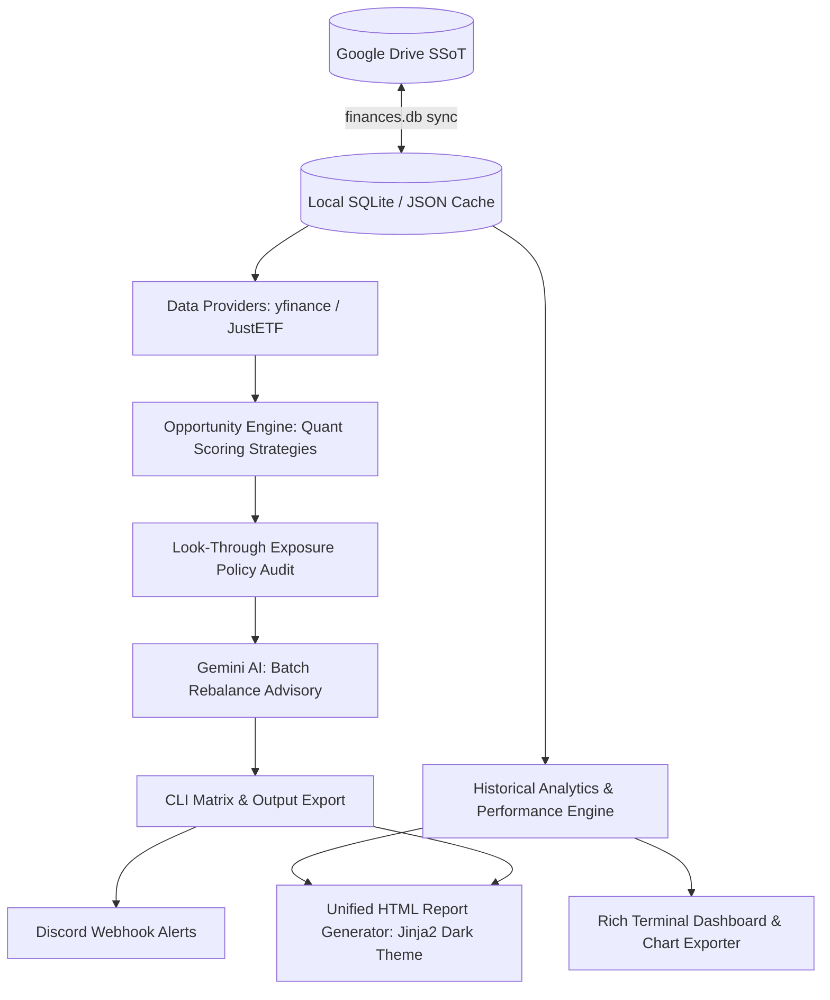

# Finances Portfolio Tracker & Opportunity Engine


<br />


<br />


> **⚠️ Financial Disclaimer:** This software is for educational and personal portfolio tracking only. It does not constitute financial advice. Algorithmic scores and Gemini AI recommendations are automated insights, not trading signals. Read the full [DISCLAIMER.md](DISCLAIMER.md) before executing any commands. Use at your own risk.

---

The **Finances Portfolio Tracker & Opportunity Engine** is a command-line application engineered to track personal investment portfolios, monitor real-time prices, audit look-through exposures, evaluate fundamental quality tiers, export visual performance analytics, generate a unified dark-theme HTML report, dispatch Discord rebalance alerts, and execute **deterministic multi-factor rebalancing powered by Google Gemini AI**.

Designed with strict separation of concerns, the system uses Google Drive as a **Cloud Single Source of Truth (SSoT)** for the central database (`finances.db`) and configuration datasets. The HTML report is a derived artifact generated locally on demand. It blends real-time market data retrieval, multi-currency conversion, relational SQLite persistence, and quantitative scoring models.

---

## Quick Start

### 1. Prerequisites

- Python **3.13+**
- A Google account (for Google Drive sync and Gemini AI)
- Google Drive folder IDs and OAuth2 credentials (`secrets/credentials.json`)
- A Gemini API key from [Google AI Studio](https://aistudio.google.com/app/apikey) (`AIza...` format)

### 2. Install

```bash
git clone https://github.com/JoPedro15/finances.git
cd finances
pip install -e ".[dev]"
```

### 3. Configure

Copy `.env.example` to `.env` and populate your credentials:

```ini
GEMINI_API_KEY=your_AIza_key_here
GEMINI_MODEL=gemini-2.0-flash

GDRIVE_CLIENT_SECRET_FILE=secrets/credentials.json
GDRIVE_TOKEN_FILE=secrets/token.json
GDRIVE_CONFIG_FOLDER_ID=your_folder_id
GDRIVE_SNAPSHOT_FOLDER_ID=your_folder_id
GDRIVE_REPORTS_FOLDER_ID=your_folder_id
GDRIVE_DATABASE_FOLDER_ID=your_folder_id

DISCORD_WEBHOOK_URL=https://discord.com/api/webhooks/...
```

Place your `credentials.json` (Google OAuth2 client secret) in the `secrets/` directory.

### 4. First Run

```bash
# Authenticate with Google Drive (opens browser on first run)
make pull-config

# Migrate portfolio JSON files into SQLite
make migrate

# Run the full update cycle
make update-finances
```

---

## System Architecture

The repository follows a modular architecture segregating domain entities, infrastructure providers, scoring strategies, analytics, notifications, and presentation layers.



| Layer                    | Path                                | Description |
|:-------------------------|:------------------------------------|:------------|
| **CLI & Presentation**   | `src/cli/` & `main.py`              | Typer-powered CLI entrypoints (`dashboard`, `report`, `opportunity`, `analyze-quality`, `sync-fundamentals`, `project-growth`). |
| **Core Domain Models**   | `src/core/models.py`                | Immutable domain dataclasses (`Asset`, `Quotation`, `PortfolioSnapshot`, `GrowthProjectionScenario`, etc.). |
| **Projections Engine**   | `src/core/projections.py`           | Compound growth forecasting with inflation adjustment over 10, 20, and 30-year horizons. |
| **Scoring Strategies**   | `src/core/opportunity_evaluation/`  | Strategy pattern orchestrating asset priority scoring (`dip_score`, `cost_score`, `allocation_score`) with exposure penalty multipliers. |
| **Exposure Engine**      | `src/core/exposure.py`              | Consolidates look-through sector, geographic, and company allocations across direct equities and ETFs. |
| **Analytics Engine**     | `src/core/portfolio_analytics.py`   | Historical time-series processing, ATH tracking, drawdown analysis, and ROI calculation. |
| **HTML Report Generator**| `src/infra/report_generator.py`     | Generates a self-contained dark-theme HTML report with three navigable tabs: Portfolio, Quality, and Opportunity. |
| **AI Advisory**          | `src/infra/ai/`                     | Google Gemini API client executing batch structured JSON portfolio analysis with exponential backoff retry. |
| **Discord Notifications**| `src/infra/notifications/`          | Discord webhook integration formatting rich embeds, decision matrices, and recommendation action cards. |
| **Relational Storage**   | `src/infra/database/`               | SQLite connection management, transactional contexts, DDL schema, and historical query extractors. |
| **Cloud SSoT Engine**    | `src/infra/gdrive/`                 | Google Drive service wrapper handling bidirectional synchronisation of `finances.db` and configuration files. |
| **JustETF Scraper**      | `src/infra/justetf/`                | Web scraper retrieving ETF compositions, sector weights, country allocations, and TER metrics. |
| **Graphics & Utilities** | `src/utils/`                        | Matplotlib chart exporters (smooth Catmull-Rom curves), Jinja2 rendering helper, and ANSI-coloured terminal logging. |

---

## Core Technical Deep Dives

### 1. Deterministic Opportunity Engine & Strategy Scoring

Rather than relying solely on AI outputs, the system uses deterministic multi-factor scoring strategies:

- **Stock Strategy** (`stock_strategy.py`): Evaluates price pullbacks from recent peaks using a trapezoidal sweet-spot curve (penalising falling knives), forward vs. trailing P/E growth ratios, positioning relative to the 52-week range, and normalised relative target allocation gaps.
- **ETF Strategy** (`etf_strategy.py`): Evaluates technical discount sweet-spots, cost efficiency via Total Expense Ratio (TER), and normalised relative target allocation gaps.
- **Exposure Penalty Multipliers**: Multiplicatively scales down the `total_score` of assets that breach configured sector, country, or single-company concentration thresholds.

### 2. Look-Through Portfolio Exposure Policies

- **Look-Through Aggregation**: Unpacks underlying ETF holdings (via JustETF data) and merges them with direct equity positions to determine true portfolio-wide concentration.
- **Policy Constraints**: Enforces configurable thresholds — Country Allocation (default: max 60%), Tech Sector (max 50%), Other Sectors (max 15%), Single Company (max 15%).
- **Visual Audit Charts**: Exports pie charts visualising consolidated sector, country, and holding exposures (`make exposure`).

### 3. Absolute Quality Tier Evaluation

- **Fundamental Scoring**: Evaluates assets on a 0–100 scale, assigning Tier A, Tier B, or Tier C classifications based on profit margins, YoY revenue expansion, balance sheet leverage (Debt-to-Equity), and earnings trajectory.
- **Diagnostic Output**: Generates bull case catalysts, bear case risks, and explicit valuation status (`Undervalued`, `Fair Value`, `Overvalued`) per asset. Results are persisted to `stock_fundamental_history` and `etf_fundamental_history` in SQLite.

### 4. Historical Analytics & Performance Dashboard

- **Time-Series Valuation**: Processes full portfolio snapshots to compute historical valuation curves, All-Time Highs (ATH), and maximum drawdowns.
- **Class Allocation & Drift**: Monitors the evolving weight ratio between Stocks and ETFs, measuring deviation against target allocations.
- **Asset ROI Summary**: Computes total monetary return (€) and percentage gain (%) against cost basis for every asset.
- **Chart Export**: Renders smooth Catmull-Rom spline charts with a dark GitHub-style theme to `output/plots/`.

### 5. Long-Term Growth Projections

- **Compound Growth Engine**: Forecasts portfolio evolution over 10, 20, and 30 years using the compound interest annuity formula ($FV = PV(1+r)^t + PMT \frac{(1+r)^t - 1}{r}$).
- **Inflation Adjustment**: Discounts future nominal totals by a 2% annual inflation target to reflect purchasing power in today's Euros.
- **Historical CAGR Baseline**: Automatically computes the Compound Annual Growth Rate from SQLite history. For periods under 1 year, uses Absolute Return to maintain realistic projections.

### 6. Unified HTML Report (`portfolio_report.html`)

The central report is a single self-contained HTML file at `output/reports/portfolio_report.html`, rendered from a Jinja2 dark-theme template. It is organised into three navigable tabs:

| Tab | Contents |
|:----|:---------|
| **Portfolio** | Executive KPI cards (Total Value, ROI, Max Drawdown), performance charts, look-through exposure charts, asset positions table, 3-scenario growth projections. |
| **Quality** | Quality KPI dashboard (Tier A/B/C counts, valuation distribution), evaluated assets summary table, per-asset diagnostic cards with bull/bear cases and fundamental metrics. |
| **Opportunity** | Portfolio & strategy summary, active scoring weights, rebalancing matrix table, and — when Gemini AI is active — full Actionable Advisory Insights cards with reasoning, factor scores, and valuation metrics. |

All charts are clickable to open a full-screen lightbox overlay. The HTML file is fully self-contained (all images embedded as base64 data URIs) and requires no external dependencies to view.

### 7. Gemini AI Batch Advisory

- **Enterprise Client**: Powered by Google Gemini AI via the Google GenAI SDK, with exponential backoff retry for transient errors and quota exhaustion.
- **Batch Portfolio Analysis**: Processes the entire target asset list in a single API call, returning structured JSON validated through Pydantic (`BatchRebalanceRecommendations`).
- **Persistent Storage**: Advisory data (reasoning, valuation metrics, factor scores) is serialised as JSON and persisted to the `opportunity_asset_metrics` table, enabling historical replay in reports without re-running the AI.
- **Graceful Fallback**: Automatically falls back to the quantitative opportunity matrix if AI is unavailable or `--skip-ai` is passed.

### 8. Discord Alerts & Webhook Notifications

- **Rich Embeds**: Formats portfolio valuation totals, active strategy weights, decision matrices, and colour-coded action recommendations (`BUY` / `SELL` / `HOLD`).
- **Factor Scores & Reasoning**: Dispatches granular factor breakdowns (Dip, Valuation, Gap, Quant Total) and Gemini AI reasoning directly to configured Discord channels.

### 9. Cloud SSoT Architecture

- **Stateless Local Environment**: The local `data/` directory is ephemeral and excluded from Git.
- **Bidirectional Sync**: On `make pull-config`, required operational files (`finances.db`, `portfolio.json`, `portfolio_targets.json`, `etf_cache.json`, `system_instruction.json`) are downloaded from Google Drive. On `make push-config`, the updated database is uploaded back.
- **Reports are Derived Artifacts**: HTML reports in `output/` are regenerable at any time via `make report` and are excluded from version control and cloud sync.

---

## Strategy Configuration & Policy Limits

All strategy weights, scoring bounds, and policy thresholds are defined in `src/config.py` and overridden via `.env`:

```ini
# Scoring Strategy Weights (each group must sum to 1.0)
STOCK_WEIGHT_DIP=0.35
STOCK_WEIGHT_FORWARD_PE=0.35
STOCK_WEIGHT_52W_RANGE=0.15
STOCK_WEIGHT_ALLOCATION=0.15

ETF_WEIGHT_DIP=0.60
ETF_WEIGHT_TER=0.20
ETF_WEIGHT_ALLOCATION=0.20

# Exposure Penalty Multipliers
EXPOSURE_SECTOR_PENALTY_WEIGHT=0.30
EXPOSURE_COUNTRY_PENALTY_WEIGHT=0.20

# Exposure Policy Limits (%)
MAX_COUNTRY_ALLOCATION_PCT=60.0
MAX_TECH_ALLOCATION_PCT=50.0
MAX_OTHER_SECTOR_ALLOCATION_PCT=15.0
MAX_COMPANY_ALLOCATION_PCT=15.0
```

---

## Relational Database Schema

The central `finances.db` SQLite database is managed via transactional contexts and automatic DDL migrations (`src/infra/database/schema.py`):

| Table | Description |
|:------|:------------|
| `assets` | Registered holdings — ISIN, Yahoo ticker, quantity, average buy price, asset type. |
| `snapshots` & `asset_snapshots` | Timestamped portfolio valuation history and per-asset values in EUR. |
| `stock_fundamental_history` | Historical equity fundamentals — P/E ratios, dividend yield, 52-week range, quality tier and score. |
| `etf_fundamental_history` | Historical ETF metadata — TER, holdings JSON, sector/country breakdown JSON, quality tier and score. |
| `opportunities` | Header record per rebalancing run — timestamp, total portfolio value, AI flag. |
| `opportunity_asset_metrics` | Per-asset metrics per run — factor scores, AI action/urgency/confidence, valuation metrics, and serialised `advisory_json` for full Gemini reasoning replay. |

### Migrating Legacy JSON to SQLite

```bash
make migrate
# or: python -m src.migrate_json_to_sqlite
```

---

## CLI Reference

All commands are accessible via GNU Make shortcuts or directly through `python main.py`.

### Full Update Cycle

```bash
# Pull config → migrate → sync fundamentals → save snapshot → exposure check →
# analyze quality → analyze opportunity → dashboard + charts →
# generate HTML report → push config to Google Drive
make update-finances
```

### HTML Report

```bash
# Generate unified dark-theme HTML report and open in browser
make report

# Generate without opening browser (CI / headless)
make report FLAGS="--no-browser"
```

The report is written to `output/reports/portfolio_report.html` with three tabs: Portfolio, Quality, and Opportunity.

### Portfolio Performance & Analytics

```bash
# Render executive historical performance dashboard in terminal
make dashboard

# Render dashboard for a specific asset
make dashboard TICKER="AAPL"

# Export visual performance charts to output/plots/
make dashboard FLAGS="--export-plots"
```

### Rebalancing & Quality Analysis

```bash
# Full rebalancing pipeline: quantitative scoring + Gemini AI advisory
make analyze-opportunity

# Quantitative-only mode (no AI)
make analyze-opportunity FLAGS="--skip-ai"

# Verbose factor breakdown
make analyze-opportunity FLAGS="--verbose"

# Dispatch results to Discord
make analyze-opportunity FLAGS="--notify"

# Fundamental quality tier evaluation (all assets)
make analyze-quality

# Quality evaluation for a specific asset
make analyze-quality TICKER="AAPL"
```

### Growth Projections

```bash
# Project long-term portfolio growth (10y, 20y, 30y), Conservative / Moderate / Aggressive
make project-growth

# With custom monthly contribution
make project-growth FLAGS="--monthly-contribution 500"
```

### Data Sync & Inspection

```bash
# Pull configuration and database from Google Drive
make pull-config

# Push local configuration and database to Google Drive
make push-config

# Migrate portfolio JSON files to SQLite and push to Google Drive
make sync-portfolio

# Save timestamped portfolio valuation snapshot
make save-snapshot

# Synchronise live fundamental data into SQLite history
make sync-fundamentals

# Inspect consolidated sector, country, and company look-through exposure
make exposure

# Inspect ETF composition, TER, holdings, and sector/country breakdowns
make etf-details
# or: python main.py etf-details IE00BK5BQT36

# Inspect fundamental metrics for a stock
make stock-details
# or: python main.py stock-details AAPL
```

---

## Quality Gates & Testing

| Target                | Description |
|:----------------------|:------------|
| `make quality`        | Full quality pipeline: Black, Ruff, Mypy, Bandit, Pip-Audit, Pytest. |
| `make test`           | Unit tests with branch coverage report. |
| `make format`         | Auto-format with Black and fix lint issues with Ruff. |
| `make lint`           | Formatting check (Black), linting (Ruff), and type checking (Mypy). |
| `make security-check` | SAST scan (Bandit) and dependency vulnerability audit (Pip-Audit). |
| `make clean`          | Remove cache files, coverage reports, and build artifacts. |

CI runs automatically on every push and pull request to `main` via `.github/workflows/ci.yml`, executing all quality gates and updating the coverage badge.

---

## License

Distributed under the MIT License. See [LICENCE.md](LICENCE.md) for details.

Developed and maintained by **João Pedro** ([@JoPedro15](https://github.com/JoPedro15)).

> *Fueled by Espresso, CrossFit WODs, and powered by Gemini AI.* ☕🏋️‍♂️🤖
